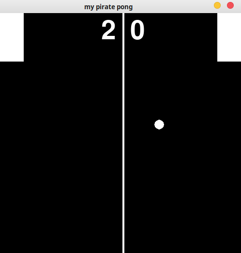

# PyGame clase 1
Aquí está la información tratada en la sesión 1 de 2 de PyGame. En esta se aprendrá:

* Generalidades de la libería
* Uso básico
* Controles por teclado
* Colisiones
* mostrar texto en pantalla

El juego que vamos a hacer es _Pong_, para observar el proceso para hacerlo, tienes que abrir el cuadreno de python, para correrlo y/o observar el código final tienes que ver los archicos __Bloques.py__ y __pong.py__

